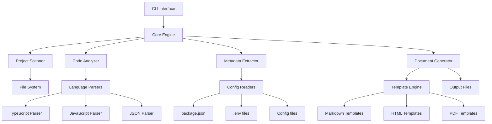

# 技术文档生成系统设计文档

## 概述

技术文档生成系统是一个基于 Node.js 的命令行工具，能够自动分析代码库并生成全面的技术文档。系统采用模块化架构，支持多种编程语言和框架，提供灵活的模板系统和多格式输出。

## 架构

### 系统架构图



### 分层架构

1. **表示层 (Presentation Layer)**
   - CLI 接口
   - 配置文件解析
   - 用户交互

2. **业务逻辑层 (Business Logic Layer)**
   - 核心引擎
   - 文档生成逻辑
   - 模板处理

3. **数据访问层 (Data Access Layer)**
   - 文件系统访问
   - 代码解析
   - 元数据提取

4. **基础设施层 (Infrastructure Layer)**
   - 语言解析器
   - 模板引擎
   - 输出格式化器

## 组件和接口

### 核心组件

#### 1. CLI Interface
```typescript
interface CLIOptions {
  input: string           // 项目根目录
  output: string          // 输出目录
  format: OutputFormat[]  // 输出格式
  template: string        // 模板路径
  config: string          // 配置文件路径
  exclude: string[]       // 排除的文件/目录
  verbose: boolean        // 详细输出
}

interface CLIInterface {
  parseArguments(args: string[]): CLIOptions
  validateOptions(options: CLIOptions): ValidationResult
  displayHelp(): void
  displayVersion(): void
}
```

#### 2. Core Engine
```typescript
interface CoreEngine {
  initialize(options: CLIOptions): Promise<void>
  generateDocumentation(): Promise<DocumentationResult>
  cleanup(): Promise<void>
}

interface DocumentationResult {
  success: boolean
  outputFiles: string[]
  errors: Error[]
  warnings: Warning[]
  statistics: GenerationStatistics
}
```

#### 3. Project Scanner
```typescript
interface ProjectScanner {
  scanDirectory(path: string, options: ScanOptions): Promise<ProjectStructure>
  getFileList(extensions: string[]): Promise<FileInfo[]>
  buildDirectoryTree(): DirectoryTree
}

interface ProjectStructure {
  rootPath: string
  files: FileInfo[]
  directories: DirectoryInfo[]
  tree: DirectoryTree
}

interface FileInfo {
  path: string
  name: string
  extension: string
  size: number
  lastModified: Date
  type: FileType
}
```

#### 4. Code Analyzer
```typescript
interface CodeAnalyzer {
  analyzeFile(filePath: string): Promise<FileAnalysis>
  extractComponents(content: string, language: Language): Component[]
  buildDependencyGraph(files: FileInfo[]): DependencyGraph
}

interface FileAnalysis {
  filePath: string
  language: Language
  components: Component[]
  imports: ImportStatement[]
  exports: ExportStatement[]
  dependencies: string[]
}

interface Component {
  name: string
  type: ComponentType
  description?: string
  parameters?: Parameter[]
  returnType?: string
  location: SourceLocation
}
```

#### 5. Metadata Extractor
```typescript
interface MetadataExtractor {
  extractProjectMetadata(rootPath: string): Promise<ProjectMetadata>
  parsePackageJson(path: string): PackageInfo
  parseEnvironmentFiles(paths: string[]): EnvironmentConfig
  extractApiEndpoints(files: FileInfo[]): ApiEndpoint[]
}

interface ProjectMetadata {
  name: string
  version: string
  description: string
  author: string
  license: string
  dependencies: Dependency[]
  scripts: Record<string, string>
  environment: EnvironmentConfig
}
```

#### 6. Document Generator
```typescript
interface DocumentGenerator {
  generateFromTemplate(template: Template, data: DocumentData): Promise<string>
  renderSection(section: DocumentSection, data: any): string
  formatOutput(content: string, format: OutputFormat): Promise<Buffer>
}

interface Template {
  name: string
  sections: TemplateSection[]
  variables: TemplateVariable[]
  format: OutputFormat
}

interface DocumentData {
  project: ProjectMetadata
  structure: ProjectStructure
  components: Component[]
  apis: ApiEndpoint[]
  dependencies: DependencyGraph
}
```

### 数据模型

#### 项目结构模型
```typescript
enum FileType {
  SOURCE = 'source',
  CONFIG = 'config',
  DOCUMENTATION = 'documentation',
  ASSET = 'asset',
  TEST = 'test'
}

enum Language {
  TYPESCRIPT = 'typescript',
  JAVASCRIPT = 'javascript',
  JSON = 'json',
  MARKDOWN = 'markdown',
  YAML = 'yaml'
}

enum ComponentType {
  FUNCTION = 'function',
  CLASS = 'class',
  INTERFACE = 'interface',
  TYPE = 'type',
  COMPONENT = 'component',
  HOOK = 'hook',
  API_ROUTE = 'api_route'
}
```

#### 模板系统模型
```typescript
interface TemplateSection {
  id: string
  title: string
  order: number
  required: boolean
  template: string
  condition?: string
}

interface TemplateVariable {
  name: string
  type: VariableType
  required: boolean
  defaultValue?: any
  description: string
}

enum OutputFormat {
  MARKDOWN = 'markdown',
  HTML = 'html',
  PDF = 'pdf',
  JSON = 'json'
}
```

## 数据模型

### 核心数据结构

#### 1. 项目信息
```typescript
interface ProjectInfo {
  metadata: ProjectMetadata
  structure: ProjectStructure
  analysis: ProjectAnalysis
  configuration: ProjectConfiguration
}

interface ProjectAnalysis {
  components: ComponentAnalysis[]
  dependencies: DependencyAnalysis
  apis: ApiAnalysis[]
  performance: PerformanceMetrics
}
```

#### 2. 组件分析
```typescript
interface ComponentAnalysis {
  component: Component
  usage: UsageInfo[]
  relationships: ComponentRelationship[]
  complexity: ComplexityMetrics
}

interface UsageInfo {
  filePath: string
  lineNumber: number
  context: string
}

interface ComponentRelationship {
  type: RelationshipType
  target: string
  description: string
}

enum RelationshipType {
  IMPORTS = 'imports',
  EXTENDS = 'extends',
  IMPLEMENTS = 'implements',
  USES = 'uses',
  CALLS = 'calls'
}
```

#### 3. API 分析
```typescript
interface ApiAnalysis {
  endpoint: ApiEndpoint
  method: HttpMethod
  parameters: ApiParameter[]
  responses: ApiResponse[]
  authentication: AuthenticationInfo
}

interface ApiEndpoint {
  path: string
  method: HttpMethod
  description: string
  tags: string[]
  deprecated: boolean
}

interface ApiParameter {
  name: string
  type: ParameterType
  required: boolean
  description: string
  example?: any
}
```

## 正确性属性

*属性是一个特征或行为，应该在系统的所有有效执行中保持为真。属性作为人类可读规范和机器可验证正确性保证之间的桥梁。*

### 属性反思

在分析所有验收标准后，我识别出以下可以合并的冗余属性：
- 文件扫描和识别相关的属性可以合并为一个综合的文件处理属性
- 各种格式解析的属性可以合并为通用的解析正确性属性
- 多格式输出的属性可以合并为输出一致性属性
- 错误处理相关的属性可以合并为健壮性属性

### 核心正确性属性

**属性 1: 文件扫描完整性**
*对于任意* 项目目录，扫描后返回的文件列表应包含所有符合条件的源代码文件和配置文件，且目录结构信息完整准确
**验证需求: Requirements 1.1, 1.2, 1.4**

**属性 2: 代码解析正确性**
*对于任意* 有效的源代码文件，解析后应正确识别所有函数、类、接口、类型定义和组件结构
**验证需求: Requirements 2.1, 2.2, 2.3, 2.5**

**属性 3: 配置解析一致性**
*对于任意* 有效的配置文件，解析后提取的元数据、依赖关系和环境变量应与文件内容完全一致
**验证需求: Requirements 1.3, 2.4**

**属性 4: 依赖关系构建正确性**
*对于任意* 项目的模块依赖关系，构建的依赖图应准确反映所有 import/export 关系和组件关系
**验证需求: Requirements 3.1, 3.2, 3.3, 3.4**

**属性 5: 文档生成完整性**
*对于任意* 项目数据，生成的文档应包含所有必要章节（概述、架构、API、配置），且内容与源数据一致
**验证需求: Requirements 4.1, 4.2, 4.3, 4.4, 4.5**

**属性 6: 多格式输出一致性**
*对于任意* 文档内容，在不同输出格式（Markdown、HTML、PDF）下生成的文档应保持内容一致性
**验证需求: Requirements 5.1, 5.2, 5.3, 5.4**

**属性 7: 模板处理正确性**
*对于任意* 有效的自定义模板，模板变量应被正确替换，章节结构应按指定顺序组织
**验证需求: Requirements 6.1, 6.2, 6.3, 6.4**

**属性 8: 增量更新准确性**
*对于任意* 文件变更，增量更新应只重新处理变更的部分，保留未变更内容，并正确标记更新部分
**验证需求: Requirements 7.1, 7.2, 7.3, 7.4**

**属性 9: 配置处理正确性**
*对于任意* 有效的配置选项，系统应正确读取配置、应用排除规则、保存到指定位置、添加自定义内容
**验证需求: Requirements 8.1, 8.2, 8.3, 8.4**

**属性 10: 错误处理健壮性**
*对于任意* 错误情况（解析失败、模板错误、信息缺失、处理中断），系统应提供适当的错误处理和恢复机制
**验证需求: Requirements 9.1, 9.2, 9.3, 9.4**

**属性 11: 性能优化有效性**
*对于任意* 大型项目，系统应使用并行处理、缓存机制、流式处理等优化技术，并提供准确的性能统计
**验证需求: Requirements 10.1, 10.2, 10.3, 10.4**

## 错误处理

### 错误分类

1. **输入错误**
   - 无效的项目路径
   - 不支持的文件格式
   - 损坏的配置文件

2. **解析错误**
   - 语法错误的源代码
   - 无法识别的代码结构
   - 循环依赖检测

3. **模板错误**
   - 无效的模板语法
   - 缺失的模板变量
   - 模板渲染失败

4. **输出错误**
   - 磁盘空间不足
   - 权限不足
   - 网络连接问题（远程模板）

### 错误处理策略

```typescript
interface ErrorHandler {
  handleParsingError(error: ParsingError): RecoveryAction
  handleTemplateError(error: TemplateError): RecoveryAction
  handleOutputError(error: OutputError): RecoveryAction
  logError(error: Error, context: ErrorContext): void
}

enum RecoveryAction {
  CONTINUE = 'continue',      // 继续处理其他文件
  RETRY = 'retry',           // 重试当前操作
  SKIP = 'skip',             // 跳过当前文件
  ABORT = 'abort'            // 终止整个过程
}
```

## 测试策略

### 双重测试方法

本系统采用单元测试和基于属性的测试相结合的方法：

**单元测试**：
- 验证特定示例和边界情况
- 测试错误条件和异常处理
- 验证组件间的集成点

**基于属性的测试**：
- 验证跨所有输入的通用属性
- 通过随机化实现全面的输入覆盖
- 每个属性测试运行最少 100 次迭代

### 测试配置

**基于属性的测试库**: 使用 `fast-check` 进行 TypeScript/JavaScript 的基于属性测试

**测试标记格式**: 每个属性测试必须使用以下格式标记：
```typescript
// Feature: technical-documentation, Property 1: 文件扫描完整性
```

**测试覆盖范围**：
- 单元测试：专注于具体示例、边界情况和错误条件
- 属性测试：验证系统在所有有效输入下的通用正确性属性
- 集成测试：验证端到端的文档生成流程

<function_calls>
<invoke name="prework">
<parameter name="featureName">technical-documentation